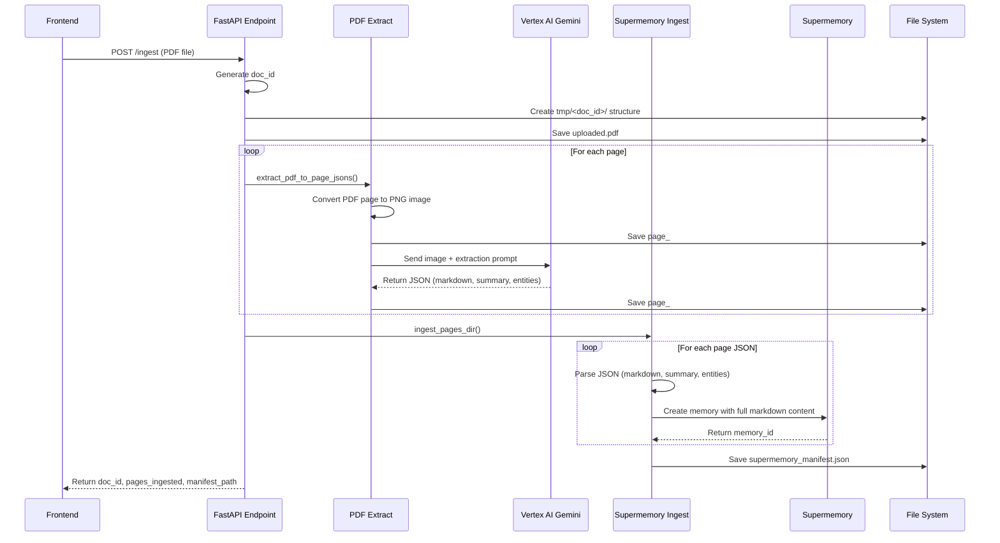
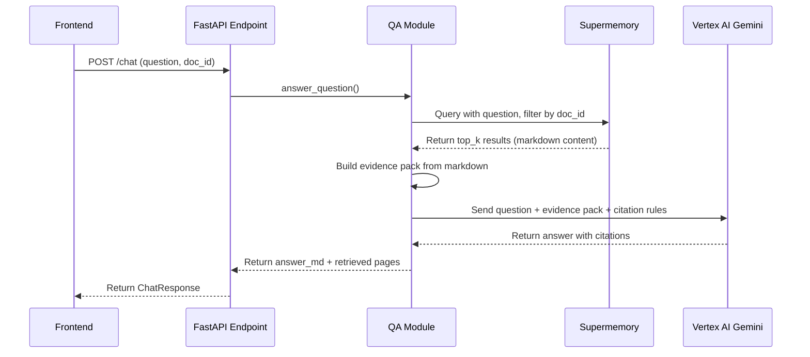
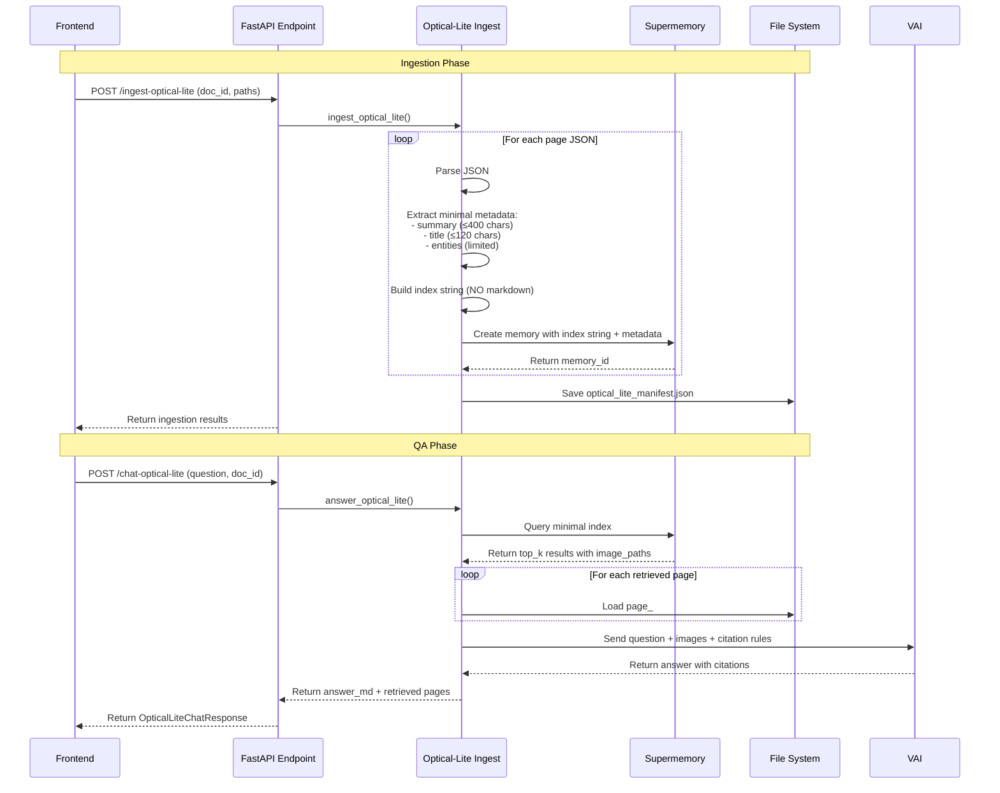
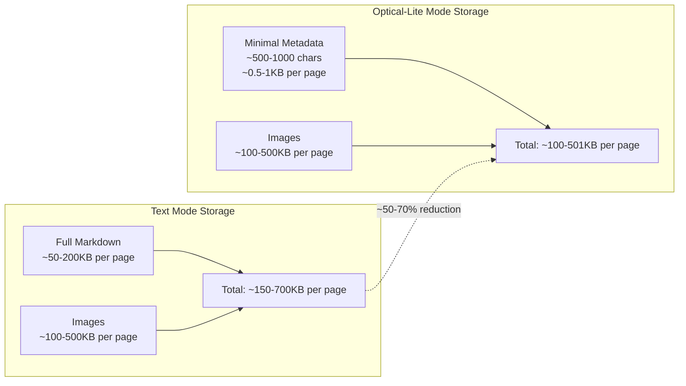

# Backend Architecture Diagram

## System Flow

```mermaid
flowchart TB
    %% External Inputs
    Frontend[Frontend UI]
    PDF[PDF Files]
    
    %% API Endpoints
    subgraph API["FastAPI Endpoints"]
        Health[GET /health]
        Ingest[POST /ingest]
        IngestCorpus[POST /ingest-corpus]
        Chat[POST /chat]
        ChatOptical[POST /chat-optical-lite]
        IngestOptical[POST /ingest-optical-lite]
        EvalResults[GET /eval-results]
    end
    
    %% Pipeline Modules
    subgraph Pipeline["Pipeline Modules"]
        PDFExtract[pdf_extract.py<br/>Extract PDF Pages]
        SupermemoryIngest[supermemory_ingest.py<br/>Text Ingestion]
        QA[qa.py<br/>Text-based QA]
        OpticalLiteIngest[optical_lite_ingest.py<br/>Optical-Lite Ingestion]
        OpticalLiteQA[optical_lite_qa.py<br/>Optical-Lite QA]
    end
    
    %% External Services
    subgraph Services["External Services"]
        VertexAI[Vertex AI Gemini<br/>gemini-3-pro-preview]
        Supermemory[Supermemory<br/>Vector Database]
    end
    
    %% Storage
    subgraph Storage["File Storage"]
        TmpDir[tmp/<doc_id>/<br/>- uploaded.pdf<br/>- pages/page_###.json<br/>- images/page_###.png<br/>- supermemory_manifest.json]
        OutputDir[output/<br/>- corpora/<corpus_id>/<br/>- optical_lite/<doc_id>/]
    end
    
    %% Evaluation
    subgraph Eval["Evaluation System"]
        EvalRunner[eval_runner.py<br/>Run Evaluations]
        EvalModule[eval/run_eval.py<br/>Evaluation Harness]
    end
    
    %% Flow: Single PDF Ingestion
    Frontend -->|Upload PDF| Ingest
    PDF -->|File Upload| Ingest
    Ingest -->|1. Generate doc_id| PDFExtract
    PDFExtract -->|2. Convert pages to images| VertexAI
    VertexAI -->|3. Extract markdown/JSON| PDFExtract
    PDFExtract -->|Save page_###.json| TmpDir
    PDFExtract -->|Save page_###.png| TmpDir
    PDFExtract -->|4. Extract stats| SupermemoryIngest
    SupermemoryIngest -->|5. Store full markdown| Supermemory
    SupermemoryIngest -->|Save manifest| TmpDir
    
    %% Flow: Corpus Ingestion
    Frontend -->|Upload Multiple PDFs| IngestCorpus
    IngestCorpus -->|Parallel Processing| PDFExtract
    PDFExtract --> SupermemoryIngest
    SupermemoryIngest -->|With corpus_id metadata| Supermemory
    IngestCorpus -->|Optional: auto_eval| EvalRunner
    
    %% Flow: Text-based QA
    Frontend -->|Question + doc_id/corpus_id| Chat
    Chat -->|1. Query Supermemory| QA
    QA -->|2. Retrieve top_k pages| Supermemory
    Supermemory -->|3. Return markdown content| QA
    QA -->|4. Build evidence pack| QA
    QA -->|5. Generate answer| VertexAI
    VertexAI -->|Answer with citations| Chat
    Chat -->|Response| Frontend
    
    %% Flow: Optical-Lite Ingestion
    Frontend -->|doc_id + paths| IngestOptical
    IngestOptical -->|1. Parse page JSONs| OpticalLiteIngest
    OpticalLiteIngest -->|2. Extract minimal metadata<br/>summary ≤400 chars<br/>title ≤120 chars<br/>limited entities| OpticalLiteIngest
    OpticalLiteIngest -->|3. Create index string<br/>NO full markdown| Supermemory
    OpticalLiteIngest -->|Save manifest| OutputDir
    
    %% Flow: Optical-Lite QA
    Frontend -->|Question + doc_id| ChatOptical
    ChatOptical -->|1. Query minimal index| OpticalLiteQA
    OpticalLiteQA -->|2. Retrieve top_k pages| Supermemory
    Supermemory -->|3. Get image_paths| OpticalLiteQA
    OpticalLiteQA -->|4. Load PNG images| TmpDir
    OpticalLiteQA -->|5. Send images + question| VertexAI
    VertexAI -->|Answer with citations| ChatOptical
    ChatOptical -->|Response| Frontend
    
    %% Flow: Evaluation
    EvalRunner -->|Run eval script| EvalModule
    EvalModule -->|Query documents| QA
    EvalModule -->|Judge answers| EvalModule
    EvalModule -->|Save results| OutputDir
    Frontend -->|Fetch results| EvalResults
    EvalResults -->|Return JSON| Frontend
    
    %% Styling
    classDef apiClass fill:#e1f5ff,stroke:#01579b,stroke-width:2px
    classDef pipelineClass fill:#f3e5f5,stroke:#4a148c,stroke-width:2px
    classDef serviceClass fill:#fff3e0,stroke:#e65100,stroke-width:2px
    classDef storageClass fill:#e8f5e9,stroke:#1b5e20,stroke-width:2px
    
    class Ingest,IngestCorpus,Chat,ChatOptical,IngestOptical,EvalResults,Health apiClass
    class PDFExtract,SupermemoryIngest,QA,OpticalLiteIngest,OpticalLiteQA,EvalRunner,EvalModule pipelineClass
    class VertexAI,Supermemory serviceClass
    class TmpDir,OutputDir storageClass
```

## Detailed Ingestion Flow

## Detailed QA Flow (Text-based)

## Detailed Optical-Lite Flow

## Storage Comparison

## Component Responsibilities

### API Layer (`app/main.py`)
- Request validation and routing
- Response formatting
- Error handling
- Parallel processing coordination

### PDF Extraction (`app/pipeline/pdf_extract.py`)
- PDF to image conversion (Poppler)
- Page-by-page processing
- Gemini vision API calls for extraction
- JSON file generation

### Text Ingestion (`app/pipeline/supermemory_ingest.py`)
- Parse page JSON files
- Extract full markdown content
- Store in Supermemory with metadata
- Generate manifest files

### Text QA (`app/pipeline/qa.py`)
- Query Supermemory with semantic search
- Build evidence packs from markdown
- Generate answers with Gemini
- Format citations

### Optical-Lite Ingestion (`app/pipeline/optical_lite_ingest.py`)
- Extract minimal metadata only
- Create compact index strings
- Store image references
- NO full markdown storage

### Optical-Lite QA (`app/pipeline/optical_lite_qa.py`)
- Query minimal Supermemory index
- Load page images from disk
- Send images directly to Gemini
- Generate answers from visual context

### Evaluation (`app/eval_runner.py`, `eval/`)
- Run evaluation harness
- Test multiple QA modes
- Judge answer quality
- Generate reports

