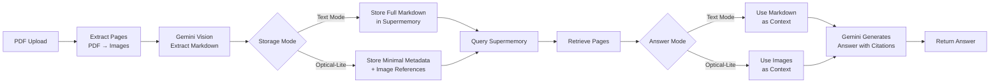

# Vision Compression Backend

FastAPI backend for PDF document ingestion and question answering using Gemini and Supermemory.

## System Flow



## Features

- **PDF Ingestion**: Extract and compress PDF pages using Gemini vision model
- **Supermemory Integration**: Ingest compressed pages into Supermemory for semantic search
- **Question Answering**: Retrieve relevant pages and generate answers with citations using Gemini
- **Optical-Lite Mode**: Storage-minimized mode using images directly as context

## Environment Variables

Create a `.env` file in the `backend` directory or set these environment variables:

```bash
# Required: Google Cloud Project ID for Vertex AI Gemini
GCP_PROJECT_ID=your-gcp-project-id
GCP_LOCATION=global  # Optional, defaults to "global"
GEMINI_MODEL=gemini-3-pro-preview  # Optional, defaults to "gemini-3-pro-preview"

# Required: Supermemory API key
SUPERMEMORY_API_KEY=your_supermemory_api_key_here

# Optional (only if required by Supermemory SDK)
SUPERMEMORY_BASE_URL=https://api.supermemory.com
SUPERMEMORY_WORKSPACE_ID=your_workspace_id

# Note: Langfuse removed - using local observability in eval/ instead
```

### Authentication for Vertex AI

**Local Development:**
1. Install Google Cloud SDK: https://cloud.google.com/sdk/docs/install
2. Authenticate using Application Default Credentials:
   ```bash
   gcloud auth application-default login
   ```
3. Set your project ID in `.env`:
   ```bash
   GCP_PROJECT_ID=your-project-id
   ```

**Cloud Run Deployment:**
- Cloud Run automatically uses the service account attached to the service
- Ensure the service account has the `Vertex AI User` role
- Set `GCP_PROJECT_ID` as an environment variable in Cloud Run

## Local Development

### Install Dependencies

**Important:** Make sure you're in a virtual environment before installing.

```bash
cd backend

# Upgrade pip and setuptools first (helps with Windows build issues)
python -m pip install --upgrade pip setuptools wheel

# Install dependencies
pip install -r requirements.txt
```

**Windows Troubleshooting:**

If `pillow` fails to build on Windows, try one of these solutions:

1. **Install pre-built wheel (recommended):**
   ```bash
   pip install --upgrade pip wheel
   pip install pillow --only-binary :all:
   pip install -r requirements.txt
   ```

2. **Or install pillow separately first:**
   ```bash
   pip install pillow
   pip install -r requirements.txt
   ```

3. **If still failing, use a more recent Python version (3.11+ recommended)**

### Run Locally

```bash
# From backend directory
uvicorn app.main:app --reload
```

**Note:** If `uvicorn` command is not found, make sure:
1. Your virtual environment is activated
2. Dependencies were installed successfully
3. Try: `python -m uvicorn app.main:app --reload`

The API will be available at `http://localhost:8000`

### API Documentation

Once running, visit:
- Swagger UI: `http://localhost:8000/docs`
- ReDoc: `http://localhost:8000/redoc`

## API Endpoints

### GET /health

Health check endpoint.

**Response:**
```json
{
  "ok": true
}
```

### POST /ingest

Ingest a PDF file: extract pages and ingest into Supermemory.

**Request:** multipart/form-data
- `file` (required): PDF file
- `dpi` (optional, default: 200): DPI for image conversion
- `start_page` (optional, default: 1): Start page (1-indexed)
- `end_page` (optional, default: all pages): End page (1-indexed)
- `overwrite` (optional, default: false): Overwrite existing files

**Response:**
```json
{
  "doc_id": "20251221_123456_abc123",
  "pages_total": 10,
  "pages_ingested": 10,
  "failed_pages": [],
  "manifest_path": "tmp/20251221_123456_abc123/supermemory_manifest.json"
}
```

**Example with curl:**
```bash
curl -X POST "http://localhost:8000/ingest" \
  -F "file=@document.pdf" \
  -F "dpi=200" \
  -F "start_page=1" \
  -F "end_page=10" \
  -F "overwrite=false"
```

### POST /chat

Answer a question about an ingested document.

**Request:** application/json
```json
{
  "doc_id": "20251221_123456_abc123",
  "question": "What is the main topic of this document?",
  "top_k": 8,
  "max_chars_per_page": 1500
}
```

**Response:**
```json
{
  "doc_id": "20251221_123456_abc123",
  "answer_md": "The main topic is... (doc_id p.1, p.2)",
  "retrieved": [
    {
      "page": 1,
      "memory_id": "mem_123",
      "excerpt": "First 250 characters of the page..."
    }
  ]
}
```

**Example with curl:**
```bash
curl -X POST "http://localhost:8000/chat" \
  -H "Content-Type: application/json" \
  -d '{
    "doc_id": "20251221_123456_abc123",
    "question": "What is the main topic?",
    "top_k": 8,
    "max_chars_per_page": 1500
  }'
```

### POST /ingest-optical-lite

Ingest pages using optical-lite mode (storage-minimized: minimal metadata + image references).

**Note:** Pages must already be extracted (use `/ingest` first to extract pages).

**Request:** application/json
```json
{
  "doc_id": "20251221_123456_abc123",
  "pages_dir": "tmp/20251221_123456_abc123/pages",
  "images_dir": "tmp/20251221_123456_abc123/images",
  "pdf_path": "tmp/20251221_123456_abc123/uploaded.pdf",
  "corpus_id": "corpus_123",
  "overwrite": false,
  "render_config": null
}
```

**Response:**
```json
{
  "doc_id": "20251221_123456_abc123",
  "pages_ingested": 10,
  "failed_pages": [],
  "manifest_path": "output/optical_lite/20251221_123456_abc123/optical_lite_manifest.json"
}
```

**Example with curl:**
```bash
curl -X POST "http://localhost:8000/ingest-optical-lite" \
  -H "Content-Type: application/json" \
  -d '{
    "doc_id": "20251221_123456_abc123",
    "pages_dir": "tmp/20251221_123456_abc123/pages",
    "images_dir": "tmp/20251221_123456_abc123/images"
  }'
```

### POST /chat-optical-lite

Answer questions using optical-lite mode (retrieves pages and uses images as context).

**Request:** application/json
```json
{
  "doc_id": "20251221_123456_abc123",
  "question": "What is the main topic of this document?",
  "corpus_id": "corpus_123",
  "top_k": 8,
  "max_images": 6
}
```

**Response:**
```json
{
  "doc_id": "20251221_123456_abc123",
  "answer_md": "The main topic is... (20251221_123456_abc123 p.1, p.2)",
  "retrieved": [
    {
      "page": 1,
      "supermemory_id": "mem_123",
      "image_path": "tmp/20251221_123456_abc123/images/page_001.png",
      "error": null
    }
  ]
}
```

**Example with curl:**
```bash
curl -X POST "http://localhost:8000/chat-optical-lite" \
  -H "Content-Type: application/json" \
  -d '{
    "doc_id": "20251221_123456_abc123",
    "question": "What is the main topic?",
    "top_k": 8,
    "max_images": 6
  }'
```

## Optical-Lite Mode

Optical-lite mode is a storage-minimized ingestion and QA path that demonstrates effective long-context retrieval with minimal storage overhead. It stores only minimal metadata and image references in Supermemory (no full markdown), then uses page images directly as context for Gemini.

### How to Run Optical-Lite Ingestion

After extracting PDF pages (using the `/ingest` endpoint or `pdf_extract`), run optical-lite ingestion:

```bash
cd backend
python -m eval.ingest_optical_lite \
  --doc_id <doc_id> \
  --pages_dir <path_to_pages_dir> \
  --images_dir <path_to_images_dir> \
  [--pdf_path <path_to_pdf>] \
  [--corpus_id <corpus_id>] \
  [--overwrite] \
  [--render_config_json '{"key": "value"}']
```

**Example:**
```bash
python -m eval.ingest_optical_lite \
  --doc_id 20251221_123456_abc123 \
  --pages_dir tmp/20251221_123456_abc123/pages \
  --images_dir tmp/20251221_123456_abc123/images \
  --pdf_path tmp/20251221_123456_abc123/uploaded.pdf
```

This creates a minimal index in Supermemory and saves a manifest to:
- `backend/output/optical_lite/<doc_id>/optical_lite_manifest.json`

### How to Run Optical-Lite QA

Query documents using optical-lite mode (retrieves pages and uses images as context):

```bash
cd backend
python -m eval.qa_optical_lite \
  --doc_id <doc_id> \
  --question "<your question>" \
  [--corpus_id <corpus_id>] \
  [--top_k 8] \
  [--max_images 6]
```

**Example:**
```bash
python -m eval.qa_optical_lite \
  --doc_id 20251221_123456_abc123 \
  --question "What is the main topic of this document?" \
  --top_k 8 \
  --max_images 6
```

This retrieves relevant pages from the minimal index, loads their images, and generates an answer using Gemini with the images as context.

### How to Generate Storage Report

Compare storage usage between text mode and optical-lite mode:

```bash
cd backend
python -m eval.storage_report \
  --doc_id <doc_id> \
  --pages_dir <path_to_pages_dir> \
  --images_dir <path_to_images_dir> \
  --mode optical_lite
```

**Example:**
```bash
# Generate optical-lite report
python -m eval.storage_report \
  --doc_id 20251221_123456_abc123 \
  --pages_dir tmp/20251221_123456_abc123/pages \
  --images_dir tmp/20251221_123456_abc123/images \
  --mode optical_lite

# Generate text mode report for comparison
python -m eval.storage_report \
  --doc_id 20251221_123456_abc123 \
  --pages_dir tmp/20251221_123456_abc123/pages \
  --images_dir tmp/20251221_123456_abc123/images \
  --mode text
```

Reports are saved to:
- `backend/output/optical_lite/<doc_id>/storage_report.json`
- `backend/output/optical_lite/<doc_id>/storage_report.md`

## Docker Deployment

### Build Docker Image

```bash
cd backend
docker build -t vision-compression-backend .
```

### Run Docker Container

```bash
docker run -p 8080:8080 \
  -e GCP_PROJECT_ID=your-project-id \
  -e SUPERMEMORY_API_KEY=your_key \
  -v ~/.config/gcloud:/root/.config/gcloud:ro \
  vision-compression-backend
```

**Note:** Mount your gcloud credentials volume (`-v ~/.config/gcloud:/root/.config/gcloud:ro`) to use Application Default Credentials, or use a service account key file.

## Cloud Run Deployment

### Build and Push to Google Container Registry

```bash
# Set your project ID
export PROJECT_ID=your-project-id
export SERVICE_NAME=vision-compression-backend

# Build and push
gcloud builds submit --tag gcr.io/${PROJECT_ID}/${SERVICE_NAME}

# Deploy to Cloud Run
gcloud run deploy ${SERVICE_NAME} \
  --image gcr.io/${PROJECT_ID}/${SERVICE_NAME} \
  --platform managed \
  --region us-central1 \
  --allow-unauthenticated \
  --set-env-vars GCP_PROJECT_ID=${PROJECT_ID},SUPERMEMORY_API_KEY=your_key \
  --memory 2Gi \
  --timeout 300 \
  --service-account your-service-account@${PROJECT_ID}.iam.gserviceaccount.com
```

**Important:** Ensure the Cloud Run service account has the `Vertex AI User` role:
```bash
gcloud projects add-iam-policy-binding ${PROJECT_ID} \
  --member="serviceAccount:your-service-account@${PROJECT_ID}.iam.gserviceaccount.com" \
  --role="roles/aiplatform.user"
```

### Set Environment Variables in Cloud Run

You can also set environment variables via the Cloud Run console or using:

```bash
gcloud run services update ${SERVICE_NAME} \
  --update-env-vars GCP_PROJECT_ID=${PROJECT_ID},SUPERMEMORY_API_KEY=your_key
```

## Project Structure

```
backend/
├── app/
│   ├── __init__.py
│   ├── main.py              # FastAPI application and endpoints
│   ├── config.py            # Configuration and environment variables
│   ├── schemas.py           # Pydantic request/response models
│   └── pipeline/
│       ├── __init__.py
│       ├── pdf_extract.py   # PDF extraction with Gemini
│       ├── supermemory_ingest.py  # Supermemory ingestion
│       ├── qa.py            # Question answering
│       ├── optical_lite_ingest.py  # Optical-lite ingestion (minimal metadata)
│       ├── optical_lite_qa.py     # Optical-lite QA (image-based)
│       └── utils.py         # Utility functions
├── eval/                     # Evaluation and CLI tools
│   ├── ingest_optical_lite.py  # CLI for optical-lite ingestion
│   ├── qa_optical_lite.py     # CLI for optical-lite QA
│   └── storage_report.py       # Storage comparison tool
├── tmp/                     # Temporary file storage (per doc_id)
├── requirements.txt
├── Dockerfile
└── README.md
```

## Notes

- Temporary files are stored under `tmp/<doc_id>/` directory
- Each document gets a unique `doc_id` based on timestamp + random suffix
- The extraction process creates:
  - `tmp/<doc_id>/uploaded.pdf` - Original PDF
  - `tmp/<doc_id>/images/page_###.png` - Page images
  - `tmp/<doc_id>/pages/page_###.json` - Compressed JSON per page
  - `tmp/<doc_id>/supermemory_manifest.json` - Manifest with memory IDs

## License

MIT

